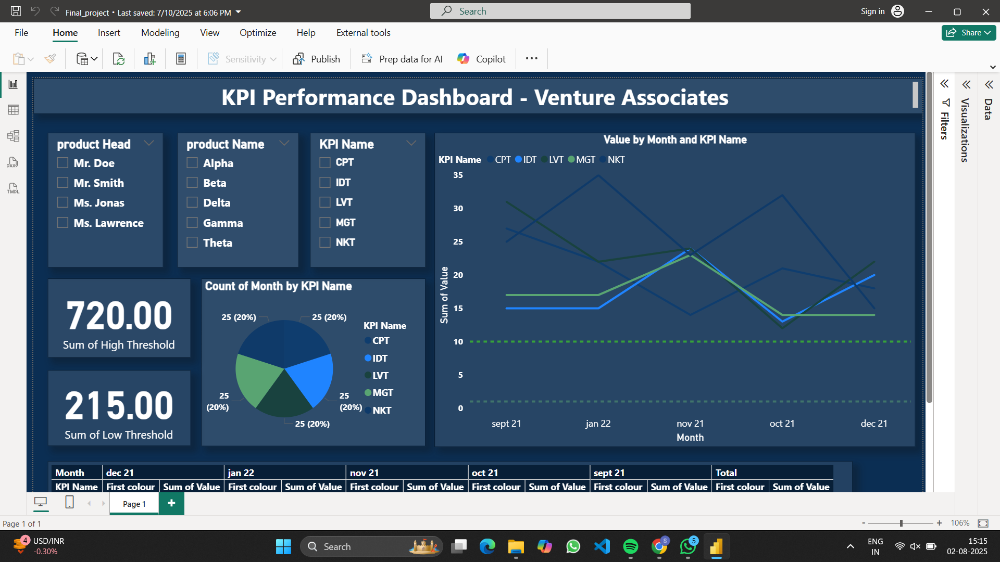
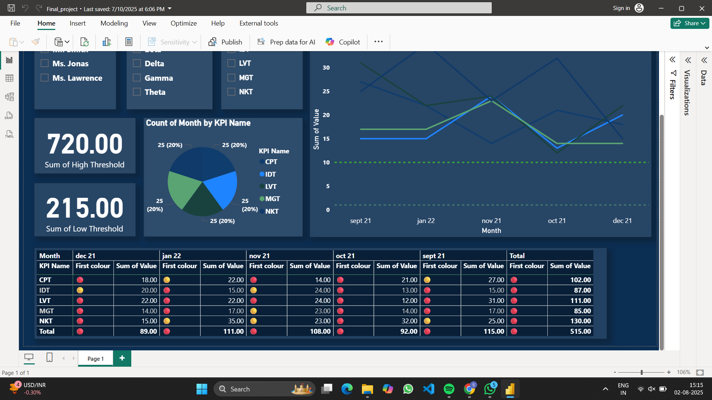

# Venture-Associates-Dashboard
# KPI Performance Dashboard – Venture Associates

This project contains a Power BI dashboard designed to monitor and analyze Key Performance Indicators (KPIs) for Venture Associates. It supports interactive filtering and data visualization for better business decisions.

## 🚀 Dashboard Features

- Interactive filters for:
  - Product Head
  - Product Name
  - KPI Name
- Visualizations:
  - Line chart showing KPI values over time
  - Pie chart showing monthly KPI count
- Threshold indicators:
  - Sum of High Threshold
  - Sum of Low Threshold

## 📌 Tools Used

- Power BI
- DAX
- Excel/CSV as data source (if applicable)

## 📸 Screenshot

## 🧾 File Structure

